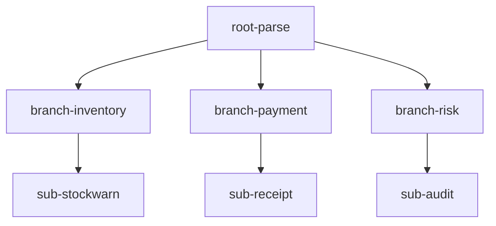

# real 示例：电商订单处理中心（树形流水线 + 吞吐统计）

演示 pipeline 组件库的**树形（Fork 分叉）拓扑**：根节点解析订单后向多个
处理分支分发，每个分支再挂子 Stage 做下游加工，并统计每个 Stage 的吞吐量。

## 运行

```bash
cd examples/real
go run .
```

运行 5 秒后自动退出（`Ctrl+C` 可提前结束）。

## 场景

电商订单处理中心的典型流水线：**定时数据源**按 10 条/秒生产随机订单
（唯一递增 ID + 随机商品/数量/金额）→ 解析 → 广播分发到三个业务分支
（**库存 / 支付 / 风控**），每个分支再挂一个子 Stage：



- `root-parse`：解析 `"ORD-00001:laptop:2:1999.9"` → `OrderInfo`；
- `branch-inventory` / `sub-stockwarn`：库存检查 + 库存不足预警；
- `branch-payment` / `sub-receipt`：支付 + 生成电子回执；
- `branch-risk` / `sub-audit`：风控评级 + 高风险转人工审计。

## 定时数据源

`timedSource` 实现 `InputSource[string]`：

- 按 `ratePerSec`（10 条/秒）周期性生成订单；
- 订单 ID 用 `atomic.Int64` 唯一递增（`ORD-00001`、`ORD-00002`…）；
- 商品 / 数量 / 金额随机生成。

## 吞吐量统计

每个 Stage 的 `Process` 内嵌 `atomic.Int64` 计数，后台 `<report>` 协程每秒
读取计数器差值并打印各 Stage 每秒吞吐量：

```
[吞吐量] root-parse=10/s  branch-inventory=10/s  branch-payment=10/s  branch-risk=10/s …
```

预期观察：
- `root-parse` ≈ 生产速率（10/s）；
- 三个分支 ≈ 同吞吐量（广播语义，每个分支处理全部订单）；
- 子 Stage（`sub-*`）在产出堆积后可能降到 0/s——因为叶子节点 output 无人
  消费（背压），真实场景叶子应连接下游消费者或充当终结点。

## 分支数据语义（Fan-out 广播，D-21）

树形 Fork 采用**广播（Fan-out）语义**：每个子 Stage 拥有独立输入 Channel
（父的 `subOutChans`），父节点每条产出数据被**复制分发到所有分支**——
每个分支都处理全部订单，互不干扰。

| 语义 | 说明 |
|------|------|
| 当前行为 | **广播**：一条订单同时经过库存 + 支付 + 风控三个分支，各分支独立处理 |
| 隔离性 | 单分支消费慢/阻塞不影响其他分支（每分支独立转发 goroutine + 超时） |

## 级联关闭

运行结束（或 `Ctrl+C`）后，Stage 递归关闭（先父后子）：
`root → 各分支 → 各子节点`，日志按关闭顺序输出。

## 参数调参

- 修改 `rateSec := 10.0` 可调整生产速率；
- 调整各分支 `Workers` / `OutCap` 可观察并发与缓冲效果；
- 金额 > 1000 → 风控标记为高 → 进入人工审计。